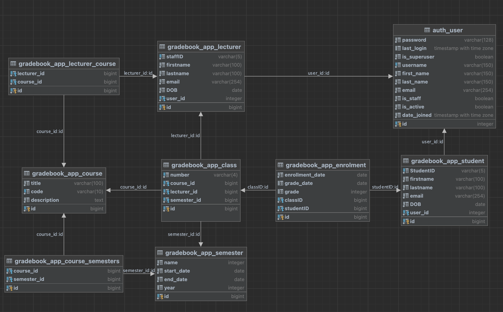

## Project Overview

- Web Application for management of grades and marks of students for a School/University.
- Implemented using Django framework along with PostgreSQL database.
- A simple development cycle with stages including Documentation, Designing, Coding, Testing and Improvement was practiced.

## Project setup
- [Checklist](./Documents/Checklist.md) to tick off once developed.
- [Developer Journal](./Documents/Developer_Journal.md) to record the learning and development progress.
- Git Management: using [Sourcetree](https://www.sourcetreeapp.com/)
- DataBase: using [PostgreSQL](./Documents/PostgreSQL_Setup.md)
- DB management: using [Data Grip](./Documents/Data_Grip.md), this is similar to PgAdmin4, but more advanced.
- Best practice to confidential: see [os.env](./Documents/os.env.md)
- [Wireframes](./Documents/Wireframe.md) for UI
- Email SMTP service with [GMail](./Documents/SMTP_Gmail.md)
- upload_student function need to use [test.xlsx](./Documents/test.xlsx)
- `django debug toolbar`: follow [link](https://django-debug-toolbar.readthedocs.io/en/latest/installation.html)
- run demo test account: [demo accounts](./Documents/demo_accounts.md)

**can be set up with: [VS Code](./Documents/VSCode_Setup.md)**

---

## Troubleshot

- upgraded pip with the my project python 3.10.6, `pip install --upgrade pip`
- use `sudo lsof -t -i tcp:8000` to monitor the port 8000, if  port 8000 is occupied, for example if 86597, then use `kill -9 86597` in terminal

---
## ERD

---
## Project Structure
##### Used built-in admin site 
- to manage **the backend CRUD** ([admin.py](./gradebook_app/admin.py) working with [models.py](./gradebook_app/models.py))

##### Dealing with many-to-many relationship
- `Semester` and `Course` is used many-to-many relationship
- `Class` and `Student` is used many-to-many relationship thru `Enrollment` (using Intermediate model to easily add more
  fields in the future and to avoid the complexity of many-to-many relationship)

##### User Authentication and Authorization
- Function-based `User Registration` in ([views.py](./gradebook_app/views.py) 
- Function-based `User Update Profile` (choose 'student' or 'lecturer' group) in [views.py](./gradebook_app/views.py), [forms.py](./gradebook_app/forms.py)
- `User login` is managed by `Built-in User Authentication` system
- Using [group_tags.py](./gradebook_app/templatetags/group_tags.py) to manage **Authorization** in the front end pages.
- templates are developed in [registration folder](./gradebook_app/templates/registration)

##### Admin site customised functions
  [admin_config](./gradebook_app/admin_config) folder is used to customise the admin site, see all comments in the py files.
1. `Upload_Student` 
- managed by function-based [upload_student view](./gradebook_app/views.py), [student_admin](./gradebook_app/admin_config/student_admin.py)
- UI is customised in the admin site, to see [templates](templates/admin/gradebook_app/student)
- [test.xlsx](./Documents/test.xlsx) is used to test the upload function
2. `Enrol/remove/show student to classes` is managed by [enrolment_admin](./gradebook_app/admin_config/enrolment_admin.py)
3. `Assign/remove/change/show a lecturer to a class` is managed by [class_admin](./gradebook_app/admin_config/class_admin.py)

##### Customised functions
  these functions were developed alongside some html templates.
1. Only `Semester` model's CRUD were tested with [generic views](./gradebook_app/views.py), and developed [templates](./gradebook_app/templates/gradebook_app/) for testing only.
2. `Lecturer to Enter Marks
- the `list_view` is managed by the class-based view [EnrolmentListView](./gradebook_app/views.py) to see the list of student who enrolled in the same class of this lecturer
- the `detail_view` is managed by class-based view [EnrolmentUpdateView](./gradebook_app/views.py) 
3. `Lecturer to Email Student` 
- the back-end is supported by Gmail's [SMTP service](./Documents/SMTP_Gmail.md)
- function is managed by function-based view [send_email_view](./gradebook_app/views.py) to send email to those students who enrolled in the same class of this lecturer
4. `Stutdent to View Marks` 
- the `list_view` is managed by [StudentEnrolmentListView](./gradebook_app/views.py) to see the list of enrolled classes (), if the student is not enrolled, will be handled by a well-displayed message.
- the `detail_view` is managed by [StudentEnrolmentDetailView](./gradebook_app/views.py) to see the detail of the course, class and the marked grade.

##### Extended codebase for **a future customised administrator**
- Generic view coded in ([views.py](./gradebook_app/views.py), 
- Display control [forms.py](./gradebook_app/forms.py))
- Rest of `models` shall repeatedly follow `Semester` model's CRUD [templates](./gradebook_app/templates/gradebook_app/)

**NOTE:** since I've used the admin-site to manage the CRUD, so I didn't use the generic view for this project.

